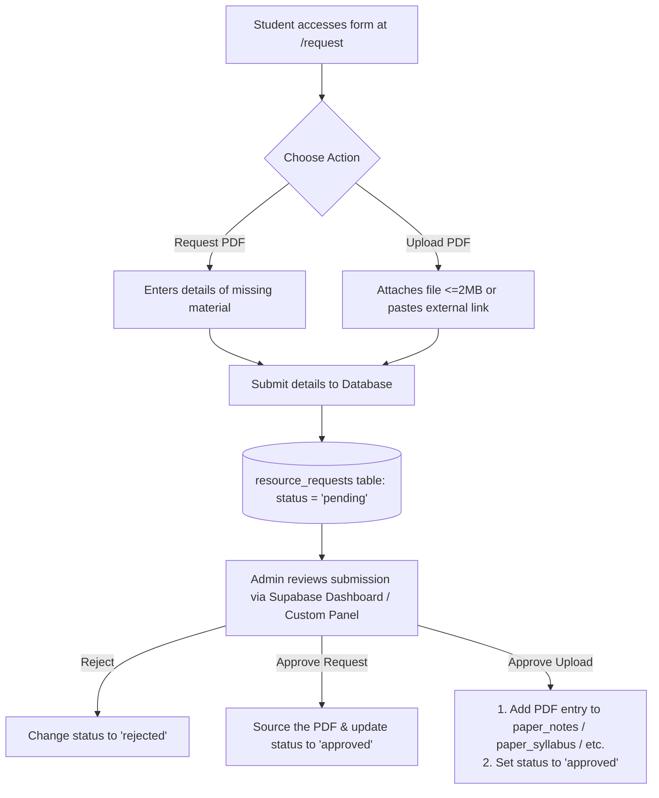

# FYIMP Hub: Resource Request & Upload Workflow Guide

This guide explains how the **Resource Upload / Request PDF** system works for both **students (user side)** and **administrators (admin side)**.

---

## Workflow Overview



---

## 1. User Side (Student Workflow)

Students click the **"Upload / Request PDF"** CTA card at the bottom of the home screen to access the form page.

### Requesting a PDF
When a student needs a resource that is not yet on the portal:
1. **Details Group**: They optionally provide their name and contact info (e.g. WhatsApp or email) so they can be notified when it is found.
2. **Academic Filters**: They select their **Department**, **Semester**, and **Subject/Paper** (mandatory). If the subject is missing, they select *"Other"* and type it manually.
3. **Resource Type**: They select the resource category (Notes, PYQs, Syllabus, Reference, or Other).
4. **Description**: They describe what they need (e.g., *"Need 2024 Semester 3 PYQ for Algebra"*).
5. **Submit**: Clicking "Submit to Hub" records the request in the database with `status = 'pending'`.

### Uploading a PDF
When a student wants to share a resource they have:
1. **Details & Info**: They provide optional user details and select the mandatory Department, Semester, Subject, and Resource Type.
2. **File Uploader**: They can attach a PDF file directly (restricted to **<= 2MB** for server storage reasons).
3. **External URL**: Alternatively, or as a backup, they can paste a sharing link (e.g. Google Drive, OneDrive) set to *"Anyone with link can view"*.
4. **Submit**: 
   - If a file is attached, it uploads to the Supabase Storage bucket (`resource-uploads`).
   - On successful upload, its public URL is fetched.
   - The document's record is created in the database with `status = 'pending'`.

---

## 2. Admin Side (Management Workflow)

Admin moderation is handled via the **Supabase Dashboard** (or an admin panel) by reading from the `resource_requests` table and managing files in the `resource-uploads` storage bucket.

### Reviewing Submissions
Admins filter the `resource_requests` table where `status = 'pending'`:
- **For Requests**: Admins see what subjects/semesters have high demand.
- **For Uploads**: Admins click `file_url` to review the submitted PDF to ensure the content is correct, high-quality, and safe.

### Moderation & Promotion Actions

#### A. Approving an Upload
Once an uploaded PDF is verified, the admin "promotes" it to become live on the site:
1. Copy the `file_url` from the `resource_requests` row.
2. Navigate to the matching target table (e.g. `paper_notes`, `paper_syllabus`, or `paper_references`) depending on the `resource_type`.
3. Create a new row in that target table:
   - Paste the `file_url` into the `pdf_url` field.
   - Fill in the associated `paper_id` and module details.
   - Ensure `is_active` is set to `true`.
4. Update the `resource_requests` row:
   - Change `status` from `'pending'` to `'approved'`.

#### B. Fulfilling a Request
When an admin or student contributor finds the document requested by a student:
1. Upload the found PDF to the appropriate live folder or storage bucket.
2. Add it to the live table (`paper_notes`, etc.) so it displays on the site.
3. (Optional) Reach out to the student using the details in `contact_info` to let them know it has been added.
4. Update the request row in `resource_requests`:
   - Change `status` to `'approved'`.

#### C. Rejecting Submissions
If a submission is low-quality, incorrect, duplicate, or blank:
1. Update the row in `resource_requests`:
   - Change `status` to `'rejected'`.
2. Delete the associated file from the `resource-uploads` storage bucket to free up space.

---

## 3. Database Schema Reference

```sql
CREATE TABLE public.resource_requests (
    id bigint GENERATED BY DEFAULT AS IDENTITY PRIMARY KEY,
    type text NOT NULL CHECK (type IN ('request', 'upload')),
    user_name text,
    contact_info text,
    department_id bigint REFERENCES public.departments(id) ON DELETE SET NULL,
    semester integer,
    paper_id bigint REFERENCES public.papers(id) ON DELETE SET NULL,
    paper_name_custom text,
    resource_type text NOT NULL CHECK (resource_type IN ('notes', 'pyq', 'syllabus', 'reference', 'other')),
    title text NOT NULL,
    description text,
    file_url text,
    status text NOT NULL DEFAULT 'pending' CHECK (status IN ('pending', 'approved', 'rejected')),
    created_at timestamp with time zone DEFAULT timezone('utc'::text, now()) NOT NULL
);
```
